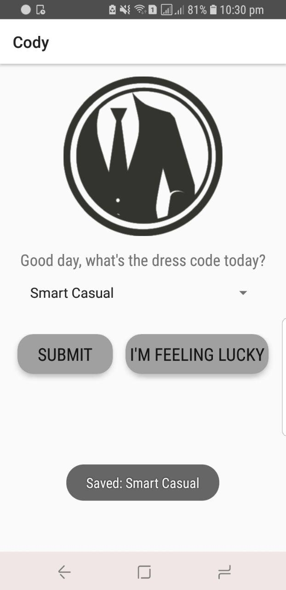

# Front Page

Currently:
* Spinner (Drop down style)
  to select dress code
* CardView + Transparent Buttons
  - to submit
  - I'm feeling lucky option
* When option is selected from spinner
  - Toast: Selected + option
* When Submit button is pressed
  - Toast: Saved + option

To Be Updated:
* Connect Submit to different pages
* Connect I'm feeling lucky to different pages

# Cody, your Fashion Assistant
Please branch from here and open pull requests to merge your app feature/ layout into master :D

## Layouts
* login page
* tip of the day
* Front page (choosing of dress code)
* Recommendations (tinder swipe thing)
* My Wardrobe
* History
* Customize
